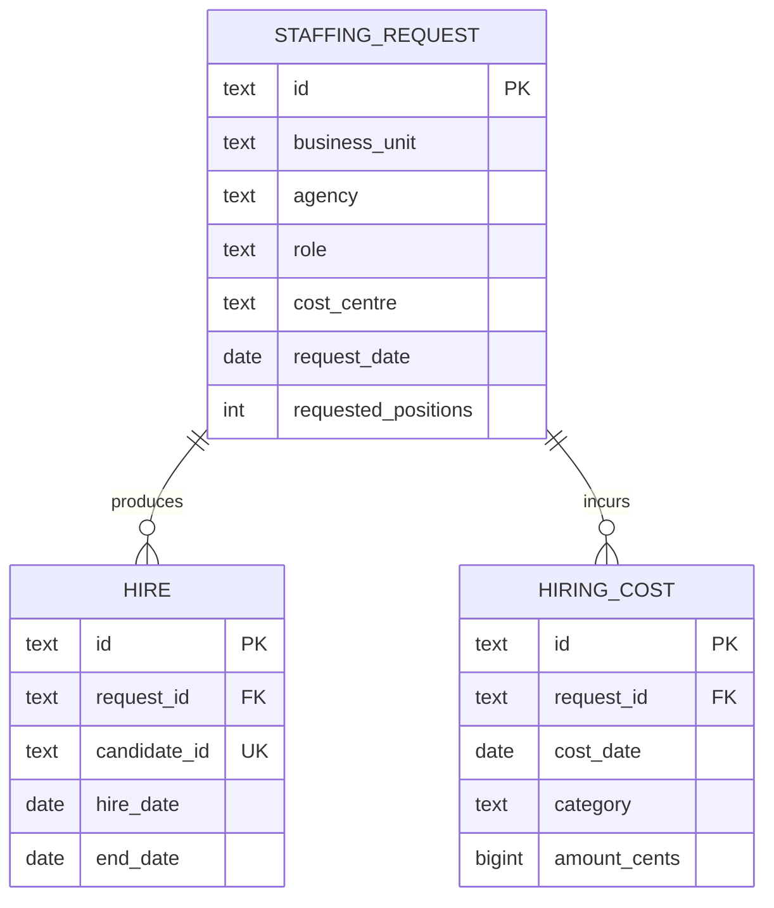

# Staffing Analytics Dashboard

A runnable portfolio project for exploring staffing delivery, hiring speed and cost. Built with **React, TypeScript, Recharts and PostgreSQL**, using a deterministic synthetic dataset rather than real candidate information.

The dashboard filters requisitions by business unit, agency, role, cost centre and request-date range. Cards, monthly trends, segment breakdowns, detail records and CSV exports share the same SQL scope.

[Live dashboard](https://LiyuanMAI.github.io/staffing-analytics-dashboard/) · [中文项目讲解](docs/interview-walkthrough.md)

## Run locally

Requires Node.js 22.12+ and pnpm 11.19.0.

```sh
corepack enable
corepack prepare pnpm@11.19.0 --activate
pnpm install
pnpm dev
```

Open the local URL printed by Vite. On first load the app initialises [PGlite](https://pglite.dev/), a WebAssembly build of PostgreSQL, and loads the fixed dataset into memory. It runs actual SQL queries in the browser; no hosted database account or API key is required. Initial engine loading may take a few seconds. Refreshing recreates the same snapshot.

```sh
pnpm test           # SQL integration tests with hand-calculated fixtures
pnpm build          # strict TypeScript check and production build
pnpm preview        # serve the production build locally
pnpm data:export    # regenerate CSVs, SQL seed and provenance
```

## Metric definitions

**The time filter is a request-cohort filter.** It selects requisitions created in the inclusive date range. Hires, departures and costs for those requests are observed through **15 September 2026**, even if they occur after the selected request window. This keeps the demand denominator and associated outcomes aligned. Monthly charts use request month, not hire month.

| Metric | Definition | Important boundary |
| --- | --- | --- |
| Fill rate | Filled positions / requested positions | Includes unfilled requests; leaving later does not undo a fill |
| Time to hire | Mean hire date minus request date | Calendar days over successful hires only; often called request-based time to fill |
| Cost per hire | Sourcing and placement costs / successful hires | Includes spending on requests with no hires; all costs in EUR |
| 90-day turnover | Hires leaving within 90 days / hires with at least 90 days of follow-up | Immature hires are excluded from both numerator and denominator; not annual workforce turnover |

Undefined ratios are `NULL` in SQL and “—” in the UI. Zero fill with positive demand is a real 0%. Overall rates use the sum of numerators divided by the sum of denominators, never the average of subgroup rates. Recent cohorts may have lower fill rates or apparently faster hiring because they are still maturing.

## Data model and aggregation



A request is assigned to exactly one agency and dimension tuple. Requested positions belong to that assignment; multiple agencies are not each credited with the same demand. This deliberately simplified model excludes cancellations, shared requisitions and replacement hires. `candidate_id` is a synthetic identifier, unique in this dataset; repeat placements are not modelled.

`sql/metrics.sql` defines the shared semantic layer as CTEs:

1. Filter requests with parameterised SQL.
2. Aggregate hires to request grain, including total hiring days and turnover eligibility.
3. Aggregate costs independently to request grain.
4. Left-join those aggregates to requests, retaining requests with no hires.
5. Project summary, monthly, dimension and detailed views in `src/data/analytics.ts`.

Joining raw hires directly to raw costs would multiply both measures. The integration suite explicitly checks this failure mode, weighted rates, date boundaries, zero denominators, every dimension filter, intersected filters, turnover maturity and cross-view reconciliation. Date windows are validated before querying, while grouping identifiers come from a fixed whitelist.

## Use a standard PostgreSQL server

The committed schema and seed are also runnable on PostgreSQL 16+. On a new, empty development database:

```sh
psql "$DATABASE_URL" -v ON_ERROR_STOP=1 -f sql/schema.sql
psql "$DATABASE_URL" -v ON_ERROR_STOP=1 -f sql/seed.sql
psql "$DATABASE_URL" -v ON_ERROR_STOP=1 -f sql/example-query.sql
```

These scripts do not drop existing tables; use a separate development database. The public UI uses PGlite, not a remote PostgreSQL connection. A production server would require an authenticated API, server-enforced tenant/row scope, migrations and operational controls. Browser filtering is **not** an authorisation boundary. No production permission-isolation claim is made here.

## Project structure

```text
src/
  App.tsx                Filters, KPI cards, Recharts views, records and CSV export
  domain.ts              Typed entities, filter validation and snapshot boundaries
  data/generate.ts       Seeded synthetic generator
  data/database.ts       Database initialisation, inserts and quality checks
  data/analytics.ts      Parameterised query composer and CSV serialisation
sql/                     Schema, semantic CTEs, generated seed and psql example
data/                    Reproducible CSVs and provenance metadata
tests/                   PostgreSQL integration tests
docs/                    Design decisions and interview walkthrough
.github/workflows/       CI and GitHub Pages deployment
```

## Publishing

The GitHub Actions workflows run tests and TypeScript/build checks. The Pages workflow uploads `dist` and deploys it when GitHub Pages is configured with **GitHub Actions** as its source. Vite uses relative asset paths so the build works under a repository subpath. No secrets are required for the public demo.

## Provenance and limitations

- Generated with seed `9152026`; fixed observation date `2026-09-15`.
- All candidate IDs, agencies, demand, hires and costs are fictional. Synthetic correlations are not findings about real agencies or the staffing market.
- This is an independent portfolio exercise inspired by common staffing analytics requirements, not an implementation of an employer's proprietary system.
- Browser database startup downloads a WebAssembly engine. This demo favours reproducibility and an accessible live preview over production bundle size.
- No login, live refresh, production backend, permissions or real operational integrations are included.
- Created with AI coding assistance. Project ownership and interview claims should reflect the parts the author has reviewed, understood and extended personally.
